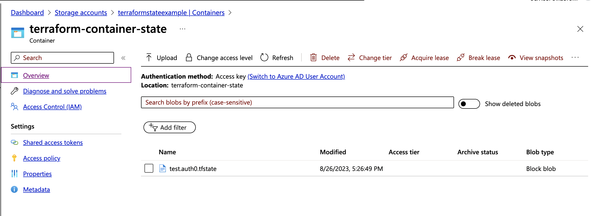
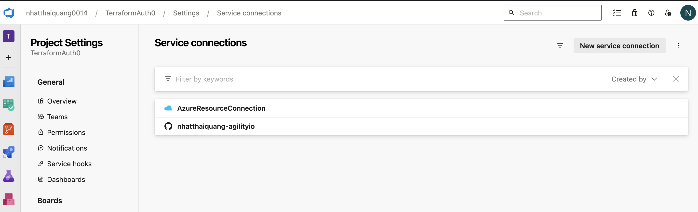
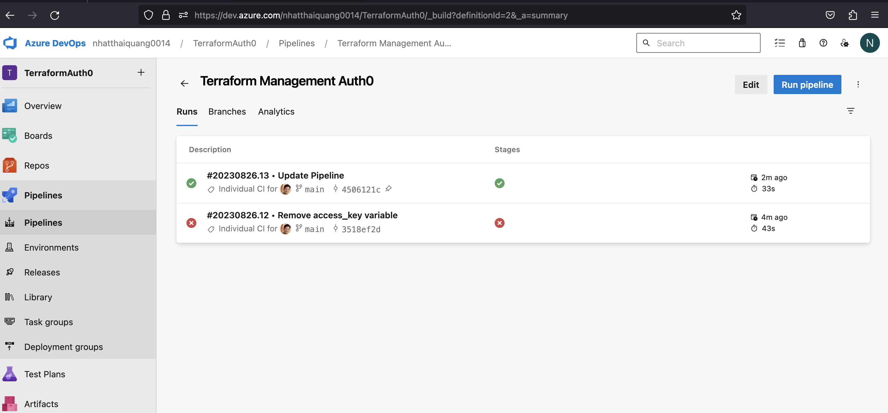
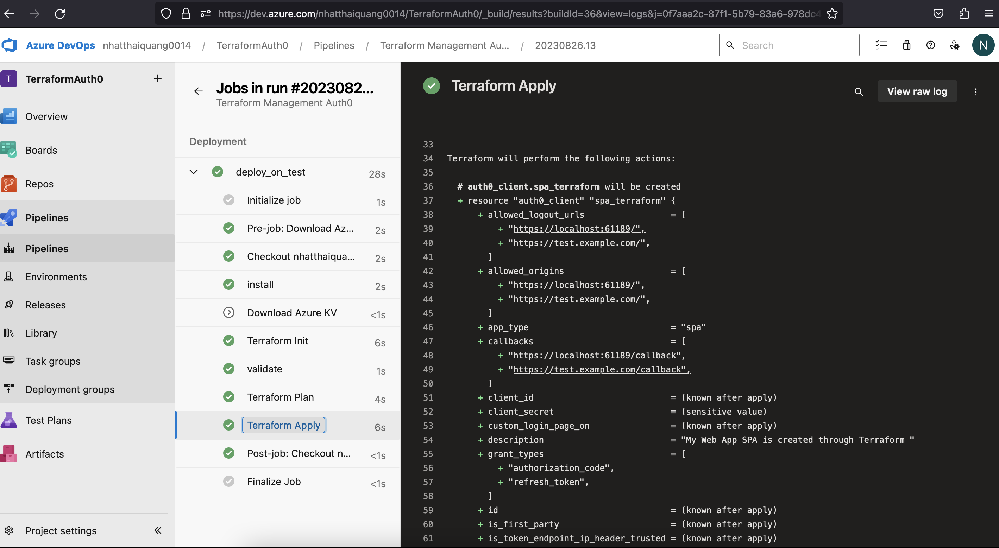
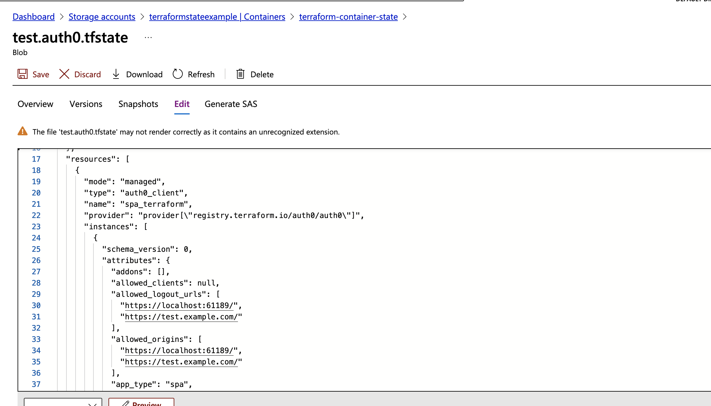
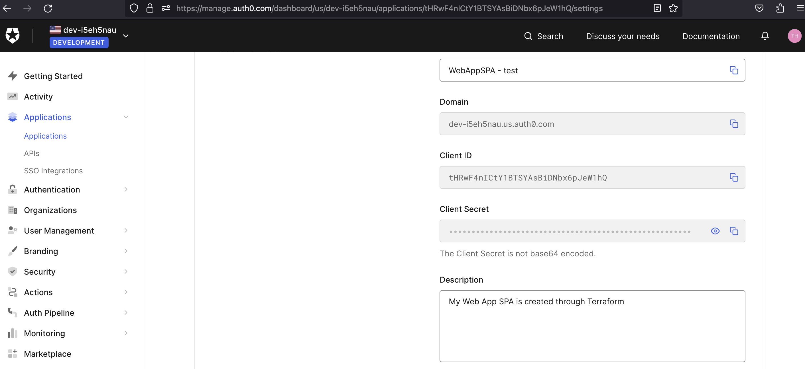

# terraform-management-auth0-with-azure-devops
    ```
    Run terraform to create an Application in Auth0 with Azure Pipeline
    + Create Terraform-CI-CD template repository (https://github.com/nhatthaiquang-agilityio/Terraform-CI-CD)
    + Apply the create-app-auth0.yml template from Terraform-CI-CD repository
    + Set Secret Values into Azure Key Vault such as StorageAccountAccessKey, TFAuth0ClientId and TFAuth0ClientSecret
    ```

### Prerequisites
+ Setup Azure DevOps

+ Setup the Storage Account in Azure & get the access key


+ Set up Service Connection in Azure 


### Result









